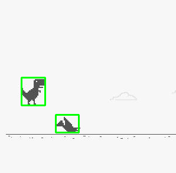
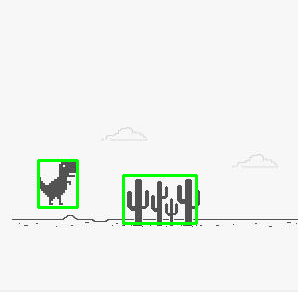

# T-rex-detr
In this project, I fine tune [DETR Model](https://github.com/facebookresearch/detr) to detect T-Rex, Cactus and Bird in the T-REX Game and automatically play the game according to their positions. 
<p align="center">


</p>
This project is inspired by https://github.com/S-Nuttapong/ObjectDetection-Play-TRex-Runner 

## Requirements 
* Python 3 
* PyTorch (used version ==1.9) 
* Torchvision (for transforms) 
* OpenCV (used version ==4.5.3) 
* PyAutoGUI 
* MSS (to grab screens) 

## How to use ? 
1. Download the model from [this drive](https://drive.google.com/file/d/1yGaDE_N1UjhiVWV6BQbkOFz4VK9zNCDl/view?usp=sharing) 
2. To test the model on a folder of images:

```
python test.py --data_path [folder_path] --resume [checkpoint_path] 
```
3. To let the model play the game for you: 
* [Open the game in a browser tab](https://www.trex-game.skipser.com/) 
* Shrink the browser tab and put it on the top left corner # you can change the desired position by fixing the resize function in detr/Image_grab.py
* uncomment the section: (from test.py main) 
```
while True:
       image_np, (width, height) = resize(capture_screenshot(x=0, y=0, w=200, h=200), percent=0.8)
       infer_image(image_np, model, postprocessors, device, args.output_dir)
       if cv2.waitKey() == ord('a'):
           break
```
* run the command: 
```
python test.py --data_path [folder_path] --resume [checkpoint_path] 
```
